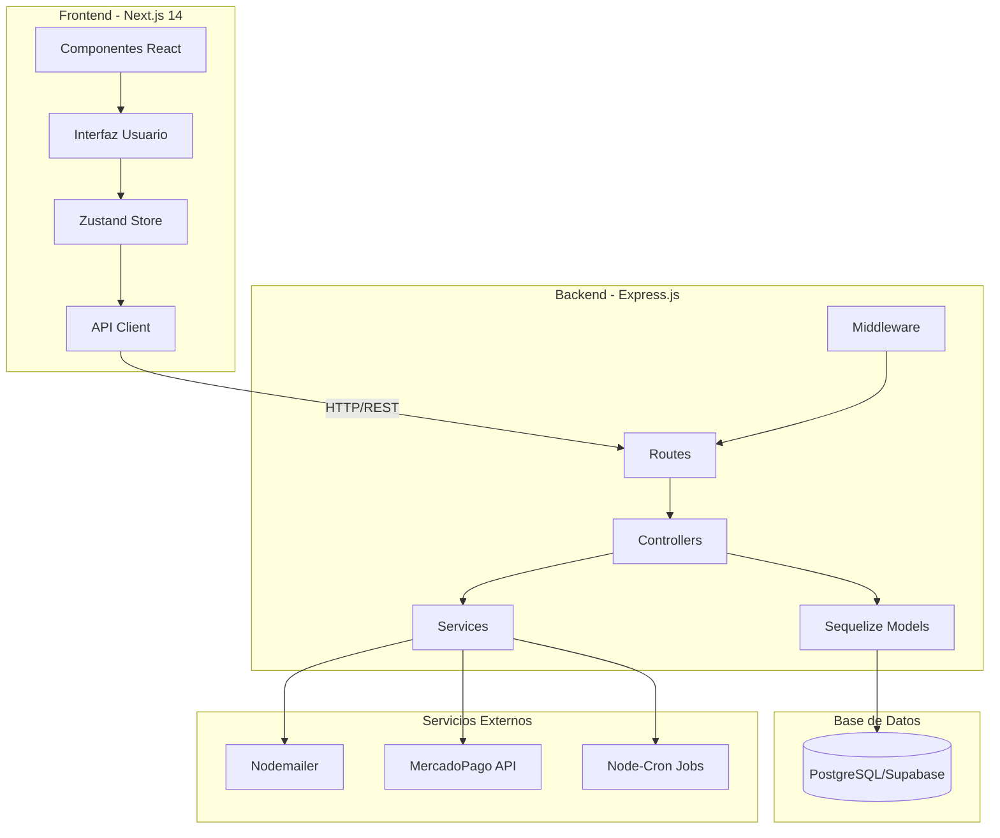
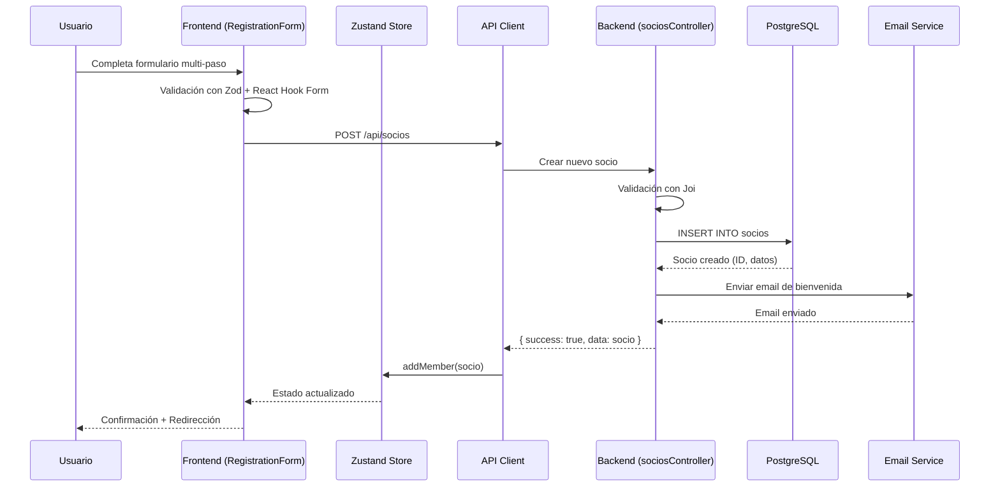
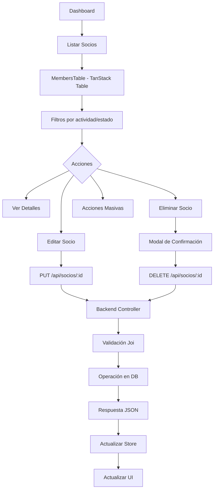
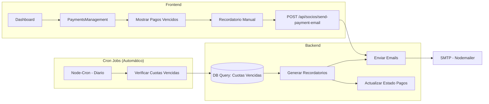
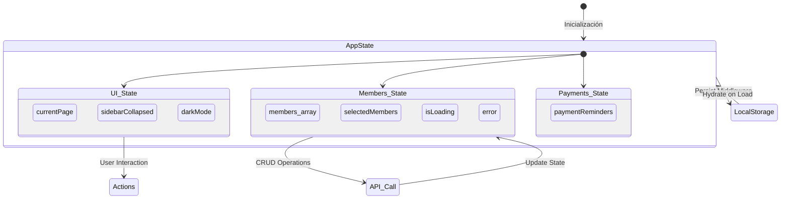
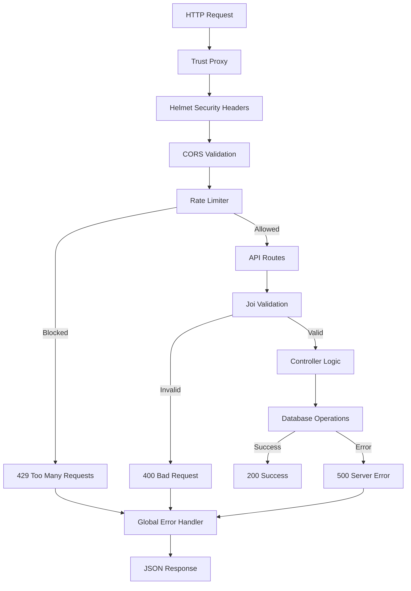
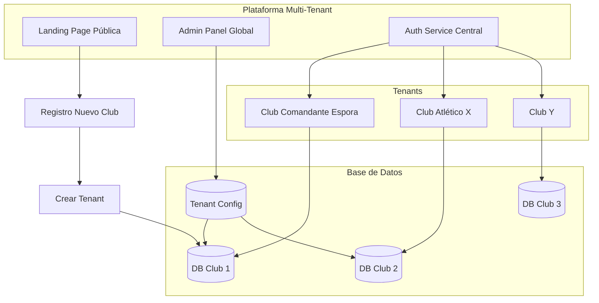

# 📊 Análisis Completo del Proyecto - Club Comandante Espora

## 📋 Resumen Ejecutivo

Sistema de gestión integral para Club Comandante Espora construido con **Next.js 14** (Frontend) y **Express.js + PostgreSQL** (Backend). Gestiona socios, jugadores, pagos, actividades deportivas (básquet, vóley, karate, gimnasio) con diseño glassmorphism y arquitectura moderna.

---

## 🏗️ Arquitectura General



---

## 🔄 Diagramas de Flujos Principales

### 1. Flujo de Registro de Nuevo Socio



### 2. Flujo de Gestión de Socios (CRUD)



### 3. Flujo de Pagos y Recordatorios



### 4. Flujo de Estado de la Aplicación (Zustand)



### 5. Flujo de Autenticación y Seguridad



---

## ✅ Fortalezas del Proyecto

### 🎯 Arquitectura y Stack Técnico
1. **Stack Moderno y Escalable**
   - Next.js 14 con App Router (React Server Components)
   - TypeScript para type safety
   - PostgreSQL con Sequelize ORM
   - Arquitectura separada Frontend/Backend

2. **Gestión de Estado Robusta**
   - Zustand con middleware de persistencia
   - Estado centralizado y predecible
   - Separación clara de concerns

3. **UI/UX Profesional**
   - Diseño glassmorphism/neumorphism único
   - Responsive design
   - Animaciones con Framer Motion
   - Componentes reutilizables bien estructurados

### 🔒 Seguridad y Validación
4. **Múltiples Capas de Seguridad**
   - Helmet para headers HTTP
   - CORS configurado correctamente
   - Rate limiting implementado
   - Validación en Backend (Joi) y Frontend (Zod)

5. **Manejo de Errores Completo**
   - Error handlers globales
   - Logging con Morgan
   - Graceful shutdown

### 🛠️ Developer Experience
6. **Testing Setup**
   - Jest configurado en Frontend y Backend
   - Tests unitarios e integración
   - Coverage configurado

7. **Deployment Ready**
   - Documentación de deploy (Vercel + Railway)
   - Variables de entorno bien estructuradas
   - Scripts de migración automática

---

## ⚠️ Debilidades y Áreas de Mejora

### 🔴 Críticas (Alta Prioridad)

#### 1. **Falta de Autenticación/Autorización**
**Problema:** No existe sistema de login, roles ni permisos. Cualquiera puede acceder a todas las funciones.

**Impacto:** 🔴 CRÍTICO - Riesgo de seguridad alto en producción

**Prompt para arreglar:**
```
Implementa un sistema completo de autenticación y autorización para el proyecto CCE:

1. Backend:
   - Modelo Usuario con roles (admin, secretario, tesorero, readonly)
   - JWT authentication
   - Middleware de autorización por roles
   - Endpoints: /api/auth/login, /api/auth/logout, /api/auth/me
   - Hash de passwords con bcrypt

2. Frontend:
   - Página de login (/login)
   - Protección de rutas con middleware
   - Contexto de autenticación
   - Manejo de tokens (httpOnly cookies o localStorage)
   - UI de logout y perfil de usuario

3. Permisos por rol:
   - Admin: acceso total
   - Secretario: gestión de socios
   - Tesorero: gestión de pagos
   - Readonly: solo lectura

Actualiza el store de Zustand y agrega interceptores en la API client para manejar tokens y errores 401.
```

#### 2. **Sincronización Frontend/Backend Débil**
**Problema:** El frontend usa store local (Zustand) que puede desincronizarse con el backend.

**Impacto:** 🟠 ALTO - Datos desactualizados, conflictos en operaciones concurrentes

**Prompt para arreglar:**
```
Migra el proyecto CCE de Zustand a React Query (TanStack Query) para gestión de estado del servidor:

1. Instala @tanstack/react-query y configura QueryClient
2. Reemplaza los métodos del store con hooks de react-query:
   - useQuery para GET /api/socios (con cache y refetch automático)
   - useMutation para POST/PUT/DELETE de socios
   - Invalidación automática de queries después de mutaciones
3. Implementa optimistic updates para mejor UX
4. Agrega estados de loading, error y stale data en UI
5. Configura refetch on window focus para datos siempre frescos
6. Mantén solo UI state (sidebar, theme) en Zustand

Actualiza MembersTable y Dashboard para usar los nuevos hooks.
```

#### 3. **Sin Sistema de Cuotas/Pagos Real**
**Problema:** Existe lógica de pagos pero sin gestión real de cuotas mensuales, historial, estados.

**Impacto:** 🟠 ALTO - Funcionalidad core incompleta

**Prompt para arreglar:**
```
Implementa un sistema completo de cuotas y pagos para el proyecto CCE:

1. Backend:
   - Modelo Cuota (monto, fechaVencimiento, fechaPago, estado, metodoPago)
   - Relación Socio -> Cuotas (hasMany)
   - Generación automática de cuotas mensuales (cron job)
   - Endpoints:
     * GET /api/cuotas?socioId=X (historial completo)
     * GET /api/cuotas/vencidas (cuotas pendientes)
     * POST /api/cuotas/:id/pagar (registrar pago)
     * POST /api/cuotas/generar-mes (generar cuotas del mes)
   - Integración con MercadoPago para pagos online

2. Frontend:
   - Tabla de cuotas por socio con filtros (pagas/pendientes/vencidas)
   - Modal de registro de pago (efectivo/transferencia/MercadoPago)
   - Dashboard con métricas: ingresos del mes, cuotas pendientes, morosidad
   - Sistema de recordatorios automáticos (email/WhatsApp)
   - Generación de recibos PDF

3. Base de datos:
   - Migración para tabla cuotas
   - Índices por estado y fechas
   - Triggers para actualizar estado del socio según cuotas
```

### 🟡 Importantes (Media Prioridad)

#### 4. **Sin Testing Coverage**
**Problema:** Tests configurados pero con coverage muy bajo o vacío.

**Prompt para arreglar:**
```
Aumenta el testing coverage del proyecto CCE a mínimo 70%:

1. Backend (Jest + Supertest):
   - Tests de integración para todos los endpoints de /api/socios
   - Tests unitarios para controllers (sociosController, pagosController)
   - Tests de modelos (validaciones, métodos)
   - Mock de servicios externos (email, MercadoPago)
   - Tests de middleware (errorHandler, validation, rateLimiter)

2. Frontend (Jest + React Testing Library):
   - Tests de componentes clave (Dashboard, MembersTable, RegistrationForm)
   - Tests del store de Zustand (actions, state mutations)
   - Tests de hooks personalizados
   - Tests de API client (con MSW para mock)
   - Tests e2e con Playwright para flujos críticos

3. CI/CD:
   - GitHub Actions workflow para tests en PRs
   - Coverage reports automáticos
   - Bloquear merge si coverage < 70%
```

#### 5. **Validaciones Incompletas**
**Problema:** Validación de DNI, teléfono, fechas puede mejorarse. Falta validación de duplicados en frontend.

**Prompt para arreglar:**
```
Mejora las validaciones del proyecto CCE en frontend y backend:

1. Frontend (Zod schemas):
   - Validación de DNI argentino (7-8 dígitos, sin letras)
   - Validación de teléfono (formatos +54 9 11 1234-5678)
   - Validación de edad mínima (>= 5 años para actividades)
   - Validación de duplicados DNI/email antes de submit (debounced API check)
   - Mensajes de error en español, claros y accionables

2. Backend (Joi):
   - Esquemas más estrictos para DNI, CUIL, email
   - Validación de fechas (no futuras para nacimiento)
   - Sanitización de inputs (trim, lowercase para emails)
   - Validación de estado transitions (Activo -> Suspendido ok, pero Suspendido -> Activo solo con pago)

3. UI:
   - Mostrar errores inline en tiempo real
   - Validación paso a paso en RegistrationForm
   - Feedback visual (checkmarks verdes, X rojas)
```

#### 6. **Performance No Optimizado**
**Problema:** No hay lazy loading, code splitting, optimización de imágenes.

**Prompt para arreglar:**
```
Optimiza el performance del frontend CCE (Next.js 14):

1. Code Splitting:
   - Lazy loading de componentes pesados (Dashboard, MembersTable)
   - Dynamic imports para modals
   - Suspense boundaries con fallbacks de carga

2. Optimización de datos:
   - Paginación en GET /api/socios (limit/offset)
   - Virtualization en MembersTable (react-window) para >100 filas
   - Debouncing en filtros y búsquedas

3. Assets:
   - next/image para todas las imágenes
   - Optimización de bundle (analizar con @next/bundle-analyzer)
   - Tree shaking de librerías no usadas

4. Caching:
   - Cache de API responses (60s para stats, 5min para socios)
   - Service Worker para offline mode básico
   - Incremental Static Regeneration para páginas públicas

5. Métricas:
   - Configurar Web Vitals monitoring
   - Lighthouse CI en pipeline
   - Target: LCP < 2.5s, FID < 100ms, CLS < 0.1
```

### 🟢 Mejoras Opcionales (Baja Prioridad)

#### 7. **Sin Modo Offline**
**Prompt para mejorar:**
```
Agrega capacidades offline al proyecto CCE con PWA:
- Service Worker para cache de assets críticos
- IndexedDB para datos de socios (solo lectura offline)
- Sync API para sincronizar cambios cuando vuelve la conexión
- Manifest.json para instalación como app
```

#### 8. **Internacionalización**
**Prompt para mejorar:**
```
Implementa i18n en CCE con next-intl:
- Soporte español e inglés
- Traducción de UI, errores, emails
- Formato de fechas, números según locale
- Selector de idioma en Header
```

---

## 💡 Ideas para Evolución del Proyecto

### Idea 1: 🏢 **Sistema Multi-Tenant (Tu Idea Original)**

**Concepto:** Plataforma SaaS donde cada club deportivo tiene su propia instancia aislada del sistema.



**Características Clave:**
- **Aislamiento por Subdominio:** `espora.clubmanager.com`, `river.clubmanager.com`
- **Base de Datos por Tenant:** Cada club tiene su propia DB PostgreSQL
- **Planes de Suscripción:**
  - Free (hasta 50 socios)
  - Pro ($X/mes - 500 socios + reportes avanzados)
  - Enterprise (ilimitado + branding personalizado + API)
- **Panel Admin Global:** Dashboard para ver todos los clubs, métricas, facturación
- **Personalización:** Logo, colores, dominios custom
- **Onboarding Automatizado:** Wizard de setup en 5 minutos

**Prompt para implementar:**
```
Transforma CCE en plataforma multi-tenant SaaS:

1. Arquitectura:
   - Modelo Tenant (nombre, subdomain, plan, estado, configuración)
   - Middleware de tenant resolution (por subdomain o header)
   - Schemas aislados por tenant en PostgreSQL
   - Row Level Security (RLS) con Supabase

2. Landing Page y Registro:
   - Next.js app en ruta raíz (/)
   - Formulario de registro de club
   - Wizard de onboarding (datos club, admin user, configuración inicial)
   - Provisioning automático de tenant

3. Panel Admin Global (/admin):
   - Lista de tenants con métricas
   - Gestión de suscripciones (Stripe integration)
   - Herramientas de soporte (login as tenant)
   - Analytics agregados

4. Modificaciones en App:
   - Tenant context provider en frontend
   - Todas las queries filtradas por tenantId
   - Subdominios dinámicos (Next.js middleware)
   - Límites por plan (ej: max socios según plan)

5. Facturación:
   - Stripe Billing para suscripciones
   - Webhooks para activar/desactivar tenants
   - Facturas automáticas
```

---

### Idea 2: 📱 **App Móvil para Socios (Mobile-First)**

**Concepto:** App móvil nativa (React Native) donde los socios pueden ver su estado, pagar cuotas, ver horarios.

**Funcionalidades:**
- 📲 Login con DNI/email
- 💳 Pago de cuotas con MercadoPago/tarjeta
- 📅 Calendario de actividades y torneos
- 🏆 Historial de asistencias
- 🔔 Notificaciones push (cuota próxima a vencer, eventos)
- 📊 Dashboard personal (estadísticas, logros)
- 🎟️ QR Code de credencial digital

**Prompt para implementar:**
```
Crea una app móvil React Native para socios del club:

1. Setup:
   - Expo + React Native
   - React Navigation para rutas
   - AsyncStorage para datos locales
   - Push notifications con Expo Notifications

2. Autenticación:
   - Login con DNI + contraseña (generar primera vez)
   - Biometría (FaceID/TouchID) para acceso rápido
   - JWT tokens desde backend

3. Funcionalidades:
   - Screen de Home: resumen estado, próxima cuota
   - Screen de Pagos: historial, pagar con MercadoPago
   - Screen de Actividades: calendario, inscripción a eventos
   - Screen de Perfil: datos personales, QR credencial

4. Backend:
   - Nuevos endpoints /api/socios/me (datos del socio logueado)
   - POST /api/socios/change-password
   - GET /api/eventos (calendario de actividades)
   - POST /api/cuotas/:id/pagar/mercadopago (deep link para pago)

5. Push Notifications:
   - Cron job para enviar recordatorios 3 días antes vencimiento
   - Notificación de pago confirmado
   - Eventos nuevos del club
```

---

### Idea 3: 📊 **Business Intelligence & Reportes Avanzados**

**Concepto:** Panel de analytics con métricas avanzadas, predicciones, exportación de reportes.

**Características:**
- 📈 **Dashboards Interactivos:**
  - Crecimiento de socios mes a mes
  - Tasa de retención/churn
  - Ingresos por actividad
  - Morosidad y proyecciones

- 🤖 **Predicciones con ML:**
  - Riesgo de abandono de socios (churn prediction)
  - Proyección de ingresos
  - Optimización de horarios según asistencia

- 📄 **Reportes Exportables:**
  - PDF/Excel de socios activos
  - Reporte mensual de tesorería
  - Certificados de socio automáticos

**Prompt para implementar:**
```
Agrega módulo de Business Intelligence al CCE:

1. Backend Analytics:
   - Endpoints:
     * GET /api/analytics/socios (growth, churn, por actividad)
     * GET /api/analytics/ingresos (mensuales, proyecciones)
     * GET /api/analytics/morosidad (tasa, tendencia)
   - Jobs de agregación diaria (materializar stats)
   - Integración con BigQuery para datos históricos

2. Frontend Dashboard BI:
   - Página /analytics con tabs: Socios, Ingresos, Actividades
   - Charts avanzados con Recharts:
     * Línea de tiempo de crecimiento
     * Funnel de conversión (registro -> pago)
     * Heatmap de asistencia por día/hora
   - Filtros por fecha, actividad, estado
   - Comparación período actual vs anterior

3. Exportación:
   - Botones "Exportar PDF" y "Exportar Excel"
   - Backend: usar pdfkit + exceljs
   - Templates profesionales con logo del club
   - Envío automático por email (reporte mensual)

4. Predicciones (Opcional):
   - Python microservice con scikit-learn
   - Modelo de churn prediction (últimas 3 cuotas, asistencia, antigüedad)
   - API endpoint /api/ml/predict-churn
   - UI: lista de socios en riesgo con score
```

---

### Idea 4: 🔗 **Integraciones y Ecosistema**

**Concepto:** Conectar el sistema con herramientas externas que los clubes ya usan.

**Integraciones:**
- **WhatsApp Business API:** Recordatorios de pago, confirmación de asistencia
- **Google Calendar:** Sincronizar eventos del club
- **Mercado Pago/Stripe:** Pagos recurrentes automáticos
- **Mailchimp:** Newsletters y email marketing
- **Google Sheets:** Exportación en tiempo real para contadores
- **Webhooks:** Permitir que otros sistemas se integren

**Prompt para implementar:**
```
Crea sistema de integraciones para CCE:

1. WhatsApp Integration:
   - Integrar WhatsApp Business API (Twilio)
   - Endpoint POST /api/integrations/whatsapp/send
   - Templates de mensajes: recordatorio pago, bienvenida, eventos
   - Opt-in/opt-out de socios

2. Google Calendar:
   - Sincronización bidireccional de eventos
   - OAuth2 con Google
   - CRUD de eventos desde CCE -> aparece en Calendar
   - Webhook de Calendar -> actualiza CCE

3. Pagos Recurrentes:
   - Mercado Pago subscriptions
   - Auto-débito mensual de cuota
   - Webhook de pago exitoso -> marcar cuota como paga

4. Webhooks Salientes:
   - Sistema de webhooks configurables por tenant
   - Eventos: socio.created, cuota.pagada, socio.suspended
   - Logs de deliveries, reintentos automáticos
   - UI para configurar webhooks en /settings/integrations

5. API Pública:
   - Documentación con Swagger/OpenAPI
   - API Keys por tenant
   - Rate limiting por API key
   - SDK en JavaScript
```

---

## 🎯 Roadmap Sugerido de Mejoras

### Sprint 1 (2 semanas) - Fundamentos Críticos
- [ ] Implementar autenticación y autorización completa
- [ ] Migrar a React Query para sincronización frontend/backend
- [ ] Sistema de cuotas y pagos completo

### Sprint 2 (2 semanas) - Testing y Calidad
- [ ] Aumentar coverage a 70% (backend + frontend)
- [ ] Mejorar validaciones y manejo de errores
- [ ] Performance optimization (code splitting, lazy loading)

### Sprint 3 (3 semanas) - Multi-Tenant MVP
- [ ] Arquitectura multi-tenant básica
- [ ] Landing page y registro de clubes
- [ ] Panel admin global
- [ ] Sistema de suscripciones con Stripe

### Sprint 4 (2 semanas) - Mobile App
- [ ] App React Native básica
- [ ] Login y perfil de socio
- [ ] Pago de cuotas desde app
- [ ] Push notifications

### Sprint 5 (2 semanas) - Analytics
- [ ] Dashboard de BI
- [ ] Reportes exportables (PDF/Excel)
- [ ] Métricas avanzadas

### Sprint 6 (1 semana) - Integraciones
- [ ] WhatsApp Business API
- [ ] Mercado Pago subscriptions
- [ ] Webhooks system

---

## 📝 Conclusión

El proyecto CCE tiene **bases sólidas** con stack moderno, arquitectura bien separada y UI profesional. Sin embargo, para pasar a producción **es crítico** implementar:

1. ✅ **Autenticación/Autorización** (bloqueante para producción)
2. ✅ **Sistema de Cuotas Real** (funcionalidad core incompleta)
3. ✅ **React Query** (evitar desincronizaciones)

La visión de **sistema multi-tenant** es excelente y viable. Con los diagramas y prompts provistos, puedes transformar CCE en una **plataforma SaaS** que sirva a múltiples clubes deportivos, generando ingresos recurrentes.

**Next Steps:**
1. Revisar este análisis con el equipo
2. Priorizar sprints según necesidades del negocio
3. Empezar por autenticación (crítico)
4. Validar modelo multi-tenant con clientes potenciales
5. Iterar en MVP incremental

---

**Generado:** 2026-01-07
**Proyecto:** Club Comandante Espora - Sistema de Gestión
**Stack:** Next.js 14 + Express.js + PostgreSQL
