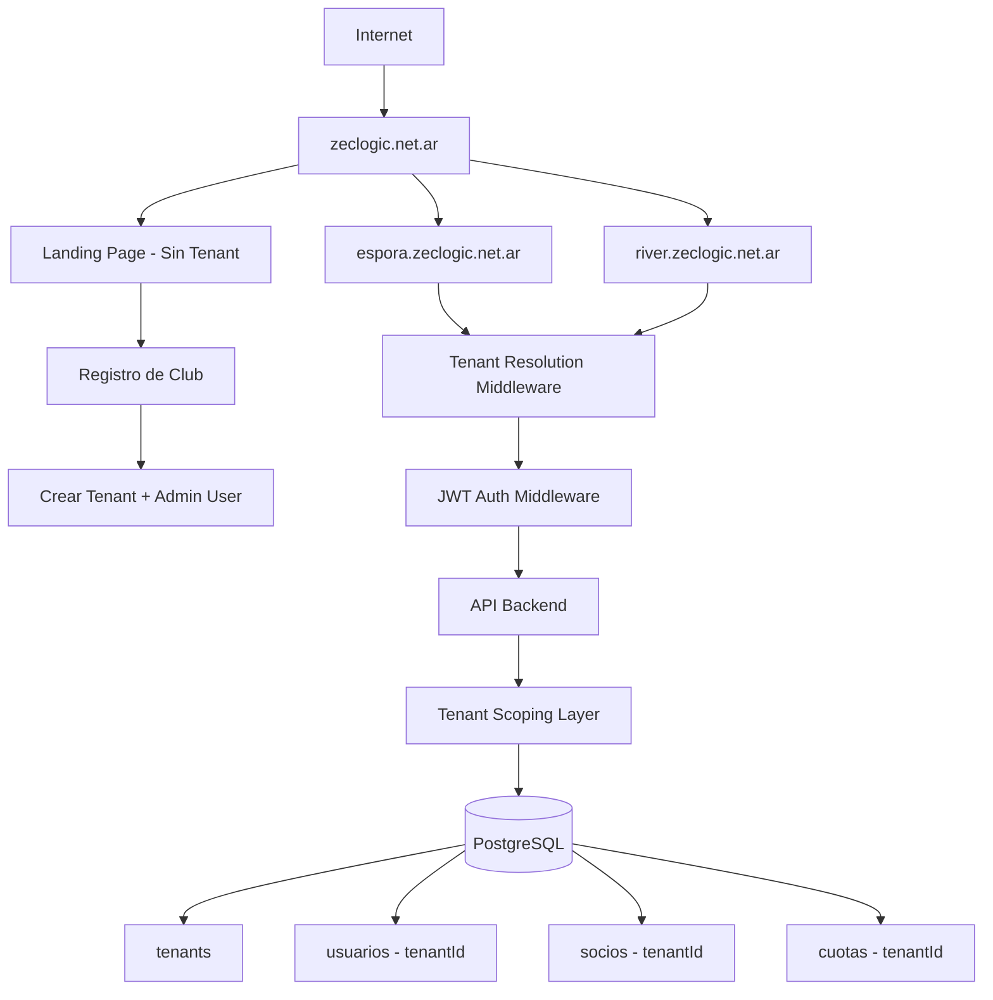
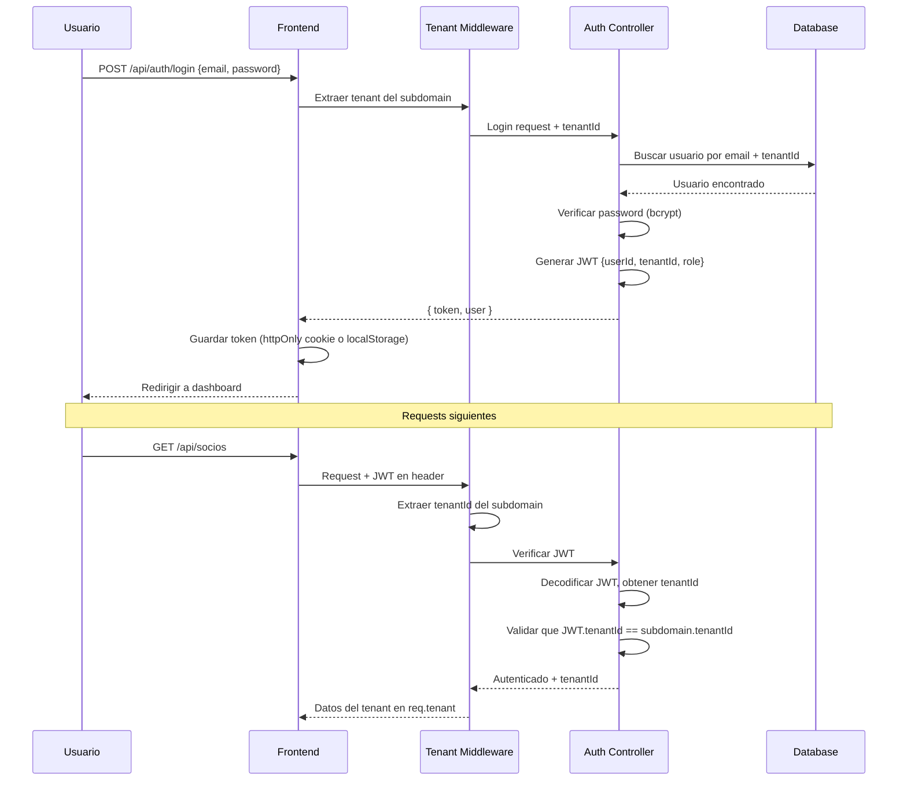

# 🏗️ Arquitectura Multi-Tenant MVP - CCE Platform

**Fecha:** 2026-01-07
**Versión:** 1.0 - MVP
**Objetivo:** Transformar CCE en plataforma SaaS multi-tenant

---

## 📋 Resumen Ejecutivo

Este documento detalla la arquitectura del MVP multi-tenant que permitirá que múltiples clubes deportivos usen la plataforma CCE de manera aislada, cada uno con su propio subdominio y datos separados.

### Alcance del MVP

**✅ Incluye:**
- Modelo Tenant (clubes)
- Autenticación JWT básica (login/logout)
- Aislamiento de datos por tenant (row-level security)
- Subdominios dinámicos (`club1.zeclogic.net.ar`, `club2.zeclogic.net.ar`)
- Landing page pública para registro de nuevos clubes
- Onboarding automático de tenants

**❌ NO incluye (para versiones futuras):**
- Roles y permisos complejos
- Facturación/suscripciones
- Panel admin avanzado
- API pública
- Sistema de cuotas avanzado (se mantiene el actual)

---

## 🎯 Arquitectura General



---

## 🗄️ Modelo de Datos

### Tabla: `tenants`

```sql
CREATE TABLE tenants (
  id SERIAL PRIMARY KEY,
  slug VARCHAR(50) UNIQUE NOT NULL,           -- 'espora', 'river' (para subdomain)
  name VARCHAR(100) NOT NULL,                  -- 'Club Comandante Espora'
  status VARCHAR(20) DEFAULT 'active',         -- 'active', 'suspended', 'trial'
  plan VARCHAR(20) DEFAULT 'free',             -- 'free', 'pro', 'enterprise'

  -- Configuración
  settings JSONB DEFAULT '{}',                 -- { logo, colores, etc }

  -- Límites
  max_members INTEGER DEFAULT 50,              -- Límite según plan

  -- Contacto
  admin_email VARCHAR(150) NOT NULL,
  admin_name VARCHAR(100) NOT NULL,
  phone VARCHAR(20),

  -- Metadata
  created_at TIMESTAMP DEFAULT NOW(),
  updated_at TIMESTAMP DEFAULT NOW(),
  trial_ends_at TIMESTAMP,

  -- Índices
  UNIQUE(slug)
);

CREATE INDEX idx_tenants_slug ON tenants(slug);
CREATE INDEX idx_tenants_status ON tenants(status);
```

### Tabla: `usuarios` (actualizada)

```sql
CREATE TABLE usuarios (
  id SERIAL PRIMARY KEY,
  tenant_id INTEGER NOT NULL REFERENCES tenants(id) ON DELETE CASCADE,

  email VARCHAR(150) UNIQUE NOT NULL,
  password_hash VARCHAR(255) NOT NULL,

  nombre VARCHAR(100) NOT NULL,
  apellido VARCHAR(100) NOT NULL,

  role VARCHAR(20) DEFAULT 'admin',            -- 'admin', 'user' (simple por ahora)
  status VARCHAR(20) DEFAULT 'active',         -- 'active', 'inactive'

  created_at TIMESTAMP DEFAULT NOW(),
  updated_at TIMESTAMP DEFAULT NOW(),
  last_login TIMESTAMP,

  UNIQUE(tenant_id, email)
);

CREATE INDEX idx_usuarios_tenant ON usuarios(tenant_id);
CREATE INDEX idx_usuarios_email ON usuarios(email);
```

### Tabla: `socios` (actualizada)

```sql
ALTER TABLE socios ADD COLUMN tenant_id INTEGER NOT NULL REFERENCES tenants(id) ON DELETE CASCADE;
CREATE INDEX idx_socios_tenant ON socios(tenant_id);

-- Cambiar unique constraints para ser por tenant
ALTER TABLE socios DROP CONSTRAINT socios_dni_key;
ALTER TABLE socios DROP CONSTRAINT socios_email_key;
CREATE UNIQUE INDEX socios_tenant_dni_unique ON socios(tenant_id, dni);
CREATE UNIQUE INDEX socios_tenant_email_unique ON socios(tenant_id, email);
```

### Tabla: `cuotas` (actualizada)

```sql
ALTER TABLE cuotas ADD COLUMN tenant_id INTEGER NOT NULL REFERENCES tenants(id) ON DELETE CASCADE;
CREATE INDEX idx_cuotas_tenant ON cuotas(tenant_id);
```

---

## 🔐 Autenticación JWT

### Flow de Autenticación



### Estructura del JWT

```json
{
  "userId": 123,
  "tenantId": 5,
  "email": "admin@espora.com",
  "role": "admin",
  "iat": 1704672000,
  "exp": 1704758400
}
```

### Endpoints de Autenticación

```
POST   /api/auth/register    # Registrar nuevo club (público)
POST   /api/auth/login       # Login de usuario existente
POST   /api/auth/logout      # Logout (invalidar token)
GET    /api/auth/me          # Obtener datos del usuario actual
POST   /api/auth/refresh     # Refrescar token (futuro)
```

---

## 🔀 Tenant Resolution (Backend)

### Middleware: `tenantResolver.js`

```javascript
// Determina el tenant actual desde:
// 1. Subdomain del request (espora.zeclogic.net.ar → espora)
// 2. Header X-Tenant-ID (para testing/API)
// 3. Query param ?tenant=espora (fallback desarrollo)

const resolveTenant = async (req, res, next) => {
  // 1. Intentar desde subdomain
  const host = req.headers.host; // espora.zeclogic.net.ar
  const subdomain = extractSubdomain(host);

  // 2. Buscar tenant en DB
  const tenant = await Tenant.findOne({
    where: { slug: subdomain, status: 'active' }
  });

  if (!tenant) {
    return res.status(404).json({ error: 'Tenant not found' });
  }

  // 3. Adjuntar tenant al request
  req.tenant = tenant;
  next();
};
```

### Middleware: `tenantScoping.js`

```javascript
// Intercepta TODAS las queries de Sequelize
// y agrega automáticamente el filtro tenantId

const applyScopingMiddleware = (req, res, next) => {
  // Crear un hook global para todas las queries
  sequelize.addHook('beforeFind', (options) => {
    if (!options.where) options.where = {};
    options.where.tenant_id = req.tenant.id;
  });

  sequelize.addHook('beforeCreate', (instance) => {
    instance.tenant_id = req.tenant.id;
  });

  next();
};
```

---

## 🌐 Frontend Multi-Tenant (Next.js)

### Middleware: `middleware.ts`

```typescript
// app/middleware.ts
import { NextResponse } from 'next/server';
import type { NextRequest } from 'next/server';

export function middleware(request: NextRequest) {
  const hostname = request.headers.get('host') || '';

  // Extraer subdomain
  const subdomain = hostname.split('.')[0];

  // Si es landing page (sin subdomain o www)
  if (subdomain === 'zeclogic' || subdomain === 'www' || !subdomain.includes('zeclogic')) {
    // Rewrite a landing page
    return NextResponse.rewrite(new URL('/landing', request.url));
  }

  // Si es subdomain de tenant (ej: espora)
  // Inyectar tenantId en headers para que el cliente lo use
  const requestHeaders = new Headers(request.headers);
  requestHeaders.set('x-tenant-slug', subdomain);

  return NextResponse.next({
    request: {
      headers: requestHeaders,
    },
  });
}

export const config = {
  matcher: [
    '/((?!api|_next/static|_next/image|favicon.ico).*)',
  ],
};
```

### Estructura de Rutas

```
app/
├── (public)/                  # Landing page y registro
│   ├── landing/
│   │   └── page.tsx          # Landing principal
│   ├── register/
│   │   └── page.tsx          # Registro de nuevo club
│   └── layout.tsx            # Layout sin auth
│
├── (tenant)/                  # Dashboard de cada tenant
│   ├── dashboard/
│   ├── socios/
│   ├── pagos/
│   ├── settings/
│   └── layout.tsx            # Layout con auth + tenant data
│
└── api/                       # API routes (proxy a backend)
    └── auth/
        └── [...nextauth].ts
```

---

## 📝 Plan de Implementación Paso a Paso

### Fase 1: Backend - Modelos y Autenticación (Día 1-2)

**Archivos a crear/modificar:**

1. ✅ **Modelo Tenant**
   - `BackendCCE/src/models/Tenant.js`
   - `BackendCCE/migrations/YYYYMMDD-create-tenant.js`

2. ✅ **Modelo Usuario actualizado**
   - `BackendCCE/src/models/Usuario.js` (agregar tenantId)
   - `BackendCCE/migrations/YYYYMMDD-update-usuario-tenant.js`

3. ✅ **Migración de modelos existentes**
   - `BackendCCE/migrations/YYYYMMDD-add-tenantid-to-socios.js`
   - `BackendCCE/migrations/YYYYMMDD-add-tenantid-to-cuotas.js`

4. ✅ **Auth Controller**
   - `BackendCCE/src/controllers/authController.js`
   - Endpoints: register, login, logout, me

5. ✅ **Middleware de autenticación**
   - `BackendCCE/src/middleware/auth.js` (verificar JWT)

### Fase 2: Backend - Tenant Resolution y Scoping (Día 2-3)

6. ✅ **Middleware de tenant resolution**
   - `BackendCCE/src/middleware/tenantResolver.js`

7. ✅ **Middleware de tenant scoping**
   - `BackendCCE/src/middleware/tenantScoping.js`

8. ✅ **Actualizar rutas existentes**
   - Aplicar middlewares a todas las rutas
   - `BackendCCE/src/routes/*.js`

9. ✅ **Seed de datos de prueba**
   - `BackendCCE/seeders/demo-tenants.js`
   - 2 tenants de ejemplo: 'espora' y 'demo'

### Fase 3: Frontend - Subdomain Routing (Día 3-4)

10. ✅ **Next.js Middleware**
    - `FrontendCCE/middleware.ts`

11. ✅ **Tenant Context Provider**
    - `FrontendCCE/lib/tenant-context.tsx`
    - Hook: `useTenant()`

12. ✅ **API Client actualizado**
    - `FrontendCCE/lib/api.ts` (inyectar tenant en headers)

13. ✅ **Auth Context**
    - `FrontendCCE/lib/auth-context.tsx`
    - Hooks: `useAuth()`, `useRequireAuth()`

### Fase 4: Frontend - Landing y Registro (Día 4-5)

14. ✅ **Landing Page**
    - `FrontendCCE/app/(public)/landing/page.tsx`
    - Hero, features, pricing, CTA

15. ✅ **Registro de Clubes**
    - `FrontendCCE/app/(public)/register/page.tsx`
    - Formulario multi-paso
    - Validación de slug único

16. ✅ **Login Page**
    - `FrontendCCE/app/(public)/login/page.tsx`

### Fase 5: Testing y Documentación (Día 5)

17. ✅ **Tests Backend**
    - Test de autenticación
    - Test de tenant isolation
    - Test de middlewares

18. ✅ **Configuración DNS Local**
    - Actualizar `/etc/hosts` para testing local
    - `127.0.0.1 espora.localhost`
    - `127.0.0.1 demo.localhost`

19. ✅ **Documentación**
    - Guía de desarrollo multi-tenant
    - Guía de deploy
    - Troubleshooting

---

## 🧪 Testing Strategy

### Testing Local con Subdominios

Agregar a `/etc/hosts` (Linux/Mac) o `C:\Windows\System32\drivers\etc\hosts` (Windows):

```
127.0.0.1 localhost
127.0.0.1 espora.localhost
127.0.0.1 demo.localhost
127.0.0.1 zeclogic.localhost
```

Luego acceder:
- Landing: `http://zeclogic.localhost:3000`
- Tenant Espora: `http://espora.localhost:3000`
- Tenant Demo: `http://demo.localhost:3000`

### Tests Automatizados

```javascript
describe('Multi-Tenant Isolation', () => {
  it('should isolate data between tenants', async () => {
    // Crear 2 tenants
    const tenant1 = await createTenant('club1');
    const tenant2 = await createTenant('club2');

    // Crear socio en tenant1
    const socio1 = await createSocio({ tenantId: tenant1.id, dni: '12345678' });

    // Intentar acceder desde tenant2
    const result = await getSociosAsTenant(tenant2.id);

    expect(result).not.toContainEqual(socio1);
  });

  it('should validate JWT tenantId matches subdomain', async () => {
    const token = generateJWT({ tenantId: 1 });

    const response = await request(app)
      .get('/api/socios')
      .set('Host', 'tenant2.localhost')
      .set('Authorization', `Bearer ${token}`);

    expect(response.status).toBe(403); // Forbidden
  });
});
```

---

## 🔒 Seguridad

### Principios de Seguridad Multi-Tenant

1. **Nunca confiar en el cliente** - El tenantId SIEMPRE se extrae del subdomain en el servidor
2. **Validación cruzada** - JWT tenantId debe coincidir con subdomain tenantId
3. **Scoping automático** - Todas las queries DEBEN filtrar por tenantId
4. **Prevenir leakage** - Tests exhaustivos de aislamiento
5. **Rate limiting por tenant** - Evitar que un tenant abuse del sistema

### Checklist de Seguridad

- [ ] JWT contiene tenantId
- [ ] Middleware valida subdomain === JWT.tenantId
- [ ] Todos los modelos tienen tenantId (foreign key con CASCADE)
- [ ] Sequelize hooks automáticos para scoping
- [ ] Tests de aislamiento de datos
- [ ] Unique constraints incluyen tenantId
- [ ] Rate limiting separado por tenant
- [ ] Logs de auditoría por tenant

---

## 📊 Métricas y Monitoring

### Métricas Clave

```javascript
// Por cada tenant:
- Total de socios
- Socios activos/inactivos
- Uso de almacenamiento
- API requests por día
- Límites del plan

// Global:
- Total de tenants activos
- Tenants en trial
- Tenants suspendidos
- Ingresos mensuales (futuro)
```

---

## 🚀 Deploy

### Variables de Entorno Adicionales

```bash
# BackendCCE/.env
JWT_SECRET=your-super-secret-key-here
JWT_EXPIRES_IN=7d
BASE_DOMAIN=zeclogic.net.ar
ALLOW_REGISTRATION=true   # false en producción si solo invitados
```

```bash
# FrontendCCE/.env.local
NEXT_PUBLIC_BASE_DOMAIN=zeclogic.net.ar
NEXT_PUBLIC_API_URL=https://zeclogic.net.ar
```

### DNS Wildcard

Configurar DNS con wildcard para subdominios:

```
A     @               181.45.123.45
A     *               181.45.123.45
CNAME www             zeclogic.net.ar
```

Esto permite que `cualquier-cosa.zeclogic.net.ar` apunte al servidor.

---

## 📝 Migración de Datos Existentes

Si ya tienes datos en producción, necesitas:

1. **Crear tenant "default"** para datos existentes
2. **Migrar datos existentes** a ese tenant
3. **Crear usuario admin** para ese tenant

```sql
-- Crear tenant default
INSERT INTO tenants (slug, name, admin_email, admin_name)
VALUES ('espora', 'Club Comandante Espora', 'admin@espora.com', 'Admin');

-- Obtener ID del tenant
-- Asumiendo id=1

-- Migrar socios existentes
UPDATE socios SET tenant_id = 1;

-- Migrar cuotas existentes
UPDATE cuotas SET tenant_id = 1;
```

---

## 🎯 Próximos Pasos Post-MVP

Una vez completado el MVP, las siguientes funcionalidades serían:

1. **Panel Admin Global** - Ver todos los tenants, métricas, gestión
2. **Sistema de Facturación** - Stripe/MercadoPago para suscripciones
3. **Roles y Permisos Avanzados** - Secretario, Tesorero, etc.
4. **React Query** - Reemplazar Zustand con server state management
5. **White Label** - Dominios custom, branding personalizado
6. **API Pública** - Webhooks y integraciones
7. **Analytics Avanzados** - Dashboard BI por tenant

---

## ✅ Checklist de Implementación

**Backend:**
- [ ] Modelo Tenant creado
- [ ] Modelo Usuario con tenantId
- [ ] Modelos Socio y Cuota con tenantId
- [ ] Migraciones ejecutadas
- [ ] Auth Controller (login, register, me)
- [ ] Middleware de autenticación (JWT)
- [ ] Middleware de tenant resolution
- [ ] Middleware de tenant scoping
- [ ] Rutas protegidas con auth
- [ ] Seeds de datos de prueba
- [ ] Tests de aislamiento

**Frontend:**
- [ ] Next.js middleware para subdominios
- [ ] Tenant Context Provider
- [ ] Auth Context Provider
- [ ] API client actualizado
- [ ] Landing page
- [ ] Registro de clubes
- [ ] Login page
- [ ] Dashboard por tenant
- [ ] /etc/hosts configurado para testing

**Deploy:**
- [ ] Variables de entorno configuradas
- [ ] DNS wildcard configurado
- [ ] SSL para subdominios (*.zeclogic.net.ar)
- [ ] Documentación actualizada

---

**Autor:** Claude + Gastón
**Proyecto:** CCE Platform Multi-Tenant
**Status:** 🚧 En Desarrollo
**Próximo:** Implementación Fase 1 - Backend
